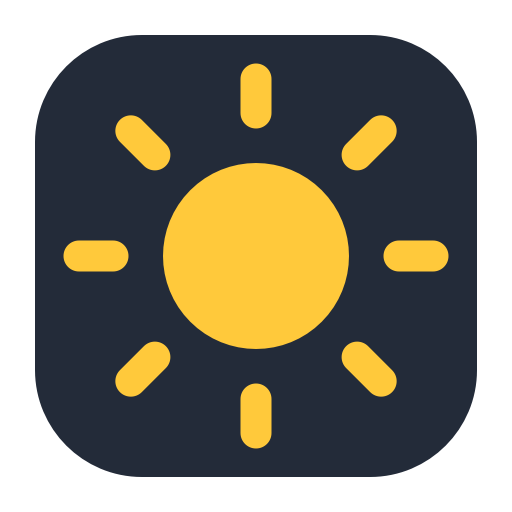

<p align="center">
  
</p>

# Nits Sync

Nits Sync is a small, menu-bar-only macOS app that keeps compatible external
monitors in step with your MacBook's built-in display brightness.

It reads the MacBook display's physical brightness in **nits** and maps it to
each external monitor through **DDC/CI**, the monitor's hardware-control
interface. Nits Sync changes the monitor's real brightness setting; it does not
add a dimming overlay or alter gamma, contrast, HDR, picture mode, or color
profiles.

## What you need

- An Apple silicon MacBook running macOS 13 or later.
- An external monitor that supports DDC/CI brightness control.
- A cable, adapter, or dock that passes DDC/CI commands to the monitor.
- Xcode 16 or later, including its command-line tools, only if you are building
  the app yourself.

Some monitors call DDC/CI simply **DDC** in their on-screen settings. Make sure
it is enabled before starting Nits Sync.

## Get started

### If you received the app from someone you trust

1. Move `Nits Sync.app` to your `/Applications` folder.
2. Open the app. Nits Sync appears as a sun icon in the macOS menu bar and does
   not open a Dock window.
3. Open the menu and confirm that **Sync Brightness** is enabled.
4. Lower the MacBook brightness by several steps and check that the external
   display follows it.

If the MacBook is brighter than an external monitor's detected ceiling, that
monitor remains at its maximum until the MacBook returns to the monitor's
range. This is expected.

### Build the app yourself

Clone this repository, open a terminal in the project folder, and run:

```sh
make app
```

The finished app is created at:

```text
dist/Nits Sync.app
```

The build uses an ad-hoc signature. To use the first valid code-signing
identity in your keychain instead, run:

```sh
make signed-app
```

That command uses the first identity reported by:

```sh
security find-identity -v -p codesigning
```

It exits with a clear message when no valid identity is available. Both build
commands create the app at `dist/Nits Sync.app`; neither installs nor launches
it. Move the app to `/Applications` before enabling **Start at Login**.

To run the automated tests:

```sh
make test
```

## Calibrate a display

Standard DDC/CI monitors report a relative brightness value, not live nits.
Nits Sync therefore stores a response curve for each physical monitor. The
detected EDID maximum is used as a starting estimate. If a monitor publishes no
luminance metadata, Nits Sync starts at 350 nits; replace that value under
**Set Maximum Nits…**.

For a closer visual match:

1. Open the monitor's submenu and choose **Calibrate This Display…**.
2. Set the MacBook to a low, middle, and high brightness in turn.
3. At each level, adjust the **External Brightness** slider until the two white
   reference patches look equally bright.
4. Record each match, then finish the calibration.

You do not need to use the monitor's on-screen brightness controls during
calibration. For measurement-grade matching, use a colorimeter.

Calibration belongs to the monitor's current picture, HDR, and energy-saving
mode. Changing one of those settings can invalidate the calibration.

## Safety and restoration

Before its first brightness write, Nits Sync reads and durably records the
monitor's original hardware brightness. Turning synchronization off or
quitting normally restores and verifies that value before completing.

A force quit, sudden power loss, or disconnected monitor can prevent an
immediate restore. Nits Sync keeps the recovery record and restores the exact
monitor safely the next time it is available.

## Low-latency mode

Enable **Low-Latency Sync** in the menu to reduce reaction time. This mode uses
a smaller deadband and fewer, shorter transport retries after a DDC error.

Brightness notifications remain immediate in either mode. If Nits Sync must
fall back to timer sampling, low-latency mode checks 20 times per second instead
of the standard 10. The tradeoff is more visible jitter on noisy monitors and
occasional temporary mismatches after transient DDC errors.

The preference is saved as `lowLatencySync` and remains enabled across app
launches.

## Troubleshooting

### No readable DDC monitor is found

- Enable DDC or DDC/CI in the monitor's on-screen menu.
- Choose **Refresh Displays** from the Nits Sync menu.
- Reconnect the display or try a direct cable; some adapters and docks do not
  pass DDC/CI commands.
- Allow a moment after waking the Mac or reconnecting a display. Nits Sync waits
  for macOS to rebuild its display services before retrying.

### The brightness match looks wrong

Set the monitor's maximum under **Set Maximum Nits…**, then use **Calibrate This
Display…**. Recalibrate after changing the monitor's HDR, picture, or
energy-saving mode.

### A display temporarily stops responding

Nits Sync retries transient DDC failures automatically. You can also choose
**Refresh Displays** at any time.

## Reset saved data

Choose **Reset Nits Sync…** to restore controlled monitors, disable **Start at
Login**, remove all saved calibration, preferences, and recovery data, and then
quit. The `Nits Sync.app` application itself remains installed.

Per-monitor profiles and the recovery journal are stored in:

```text
~/Library/Application Support/Nits Sync/
```

Older builds may also have used:

```text
~/Library/Application Support/nits-ctrl/
```

## Privacy and diagnostics

Nits Sync does not require an account or network connection. Settings,
calibration, and recovery data stay on the Mac.

The app writes only sparse diagnostics to macOS Unified Logging. It does not
create or append to its own log file. macOS manages, rotates, compresses, and
eventually removes Unified Logging data under the system's storage limits.
Successful live confirmations use debug-level messages; persistent messages
are reserved for unusual DDC failures and mismatches.

To inspect recent DDC anomalies:

```sh
log show --last 10m --style compact \
  --predicate 'subsystem == "com.local.nits-sync"'
```

## How synchronization works

Nits Sync listens for the built-in display's native macOS brightness-change
notifications and reads physical nits only when a change occurs. A one-second
watchdog catches notifications missed during sleep or display transitions. If
the private notification interface is unavailable on a macOS version, the app
falls back to timer sampling. Each notification receives a fast read and one
follow-up after 120 milliseconds in case macOS publishes the physical-nits
value late. Rapid notifications are coalesced so the external monitor receives
the newest value rather than a replay of stale steps. Neither mode uses busy
waiting.

Live synchronization sends the newest DDC brightness value immediately. After
300 milliseconds without a newer target, Nits Sync reads the monitor once to
confirm that value. If the monitor still reports an older value, the app
reapplies the newest target once and checks again. Calibration, Reset, and Quit
remain strictly verified; restoration also allows an in-flight live command to
settle before writing the saved original value.

The app retries a monitor when its first DDC read is busy or times out.
Connect/disconnect notifications are coalesced for 750 milliseconds so macOS
can finish creating the monitor's I/O services. After system or display sleep,
Nits Sync waits two seconds, discovers fresh DDC handles, and reapplies the
current target. Transient failures use a bounded 2, 4, 8, then 15-second
backoff. EDID discovery is also bounded per hardware service: an unresponsive
projector or monitor proxy is skipped after two seconds instead of blocking
newly connected displays.

## Distribution

Nits Sync uses unheadered macOS display services required for DDC on Apple
silicon. It is intended for local or Developer ID distribution outside the Mac
App Store and runs without App Sandbox. A local identity-signed build is not
automatically notarized for public distribution.

## License

Nits Sync is available under the [MIT License](LICENSE). See
[Third-Party Notices](THIRD_PARTY_NOTICES.md) for dependency information.
